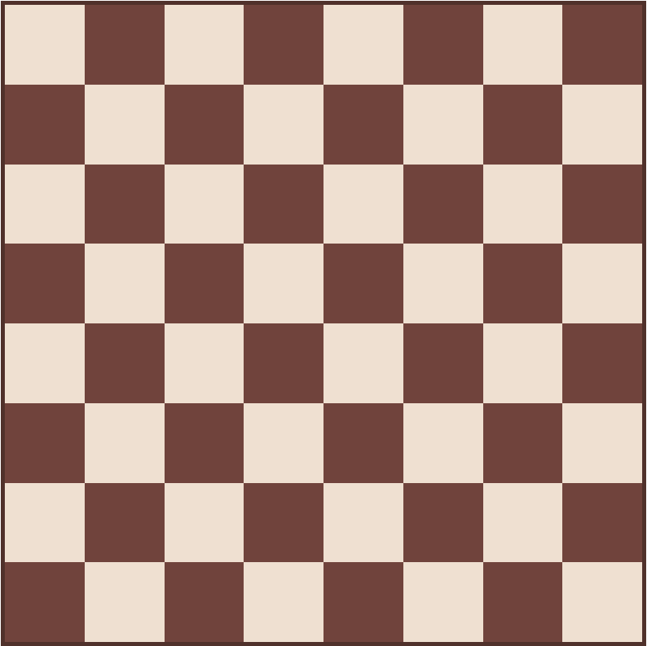

# Challenge echequier

Avec Axel, Justin et Quentin.

## Objectif

Construire un échiquier en JS :sunglasses:

## Instructions

- Il faut créer directement en JS les éléments permettant de créer les 64 cases de l'échiquier :
- Il faut rajouter des classes à ces éléments pour faire des cases de couleurs différentes.

> **Couleurs proposées**
> - Bordure de l'échiquier : #50312b
> - Case blanche : #efe0d1
> - Case noire : #70433c

## Bonus

- Mettre le nom des cases à l'intérieur de chaque case : A1, A2… B1, B2… H7, H8.
- Rendre les cases sélectionnable. Texte en rouge et bordure de 1px autour de la case selectionnée. Ce style devra être appliquer via une classe CSS et l'utilisation de `classList` est obligatoire (voir MDN).

## Whaaat ?!

- https://developer.mozilla.org/fr/docs/Web/API/Node/appendChild
- https://developer.mozilla.org/fr/docs/Web/API/Document/createElement
- https://developer.mozilla.org/en-US/docs/Web/API/Element/querySelector
- https://developer.mozilla.org/en-US/docs/Web/API/Element/classList
- https://developer.mozilla.org/fr/docs/Web/API/EventTarget/addEventListener
