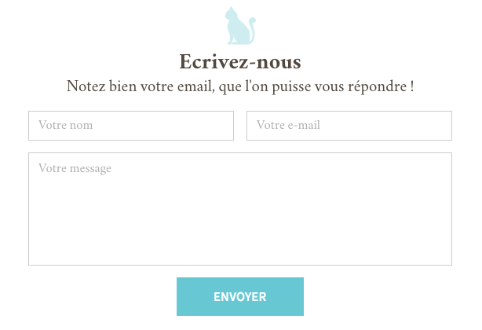
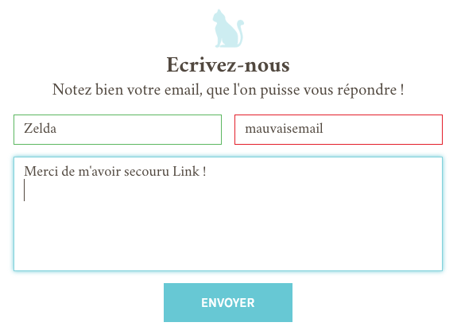

# Validation de formulaire

Pour améliorer l'UX (= expérience utilisateur) de nos visiteurs, il est important de pouvoir leur donner un feedback rapide sur les informations qu'ils ont rentré.

C'est ce qu'on va faire avec JS.

## Inté

### Polices

- Crimson Text
- Source Sans Pro

**BONUS** pour les polices

Utiliser le générateur de FontSquirrel pour ajouter les fonts Crimson Text et Source Sans Pro.  
Les fichiers de fonts sont dans le dossiers `fonts/`

https://www.fontsquirrel.com/tools/webfont-generator

### Charte

Utilisers les polices suivantes :
 * Crimson Text : texte
 * Crimson Text Bold : Titre
 * Source Sans Pro : bouton

Utiliser les couleurs suivantes :
 * texte : #51483f
 * bordure : #ccc
 * bouton/ombre : #67c8d4
 * placeholder : #afafaf
 * success : #5cb760
 * error : #e31e2a

## Events

Au submit, on va vérifier :

* Que chaque champ est rempli.
  * Si non, afficher un message d'erreur
  * Si oui, laisser le formulaire faire sa requête

* Pour chaque champ
  * On affiche une ombre bleue si le champ est actif
  * Une fois qu'il n'est plus actif, on affiche une bordure verte si le champ a été rempli
  * Une fois qu'il n'est plus actif, on affiche une bordure rouge si le champ n'a pas été rempli

* **BONUS** Si le contenu du textarea dépasse 500 caractères, afficher "Dis-donc, on a un bavard !".

