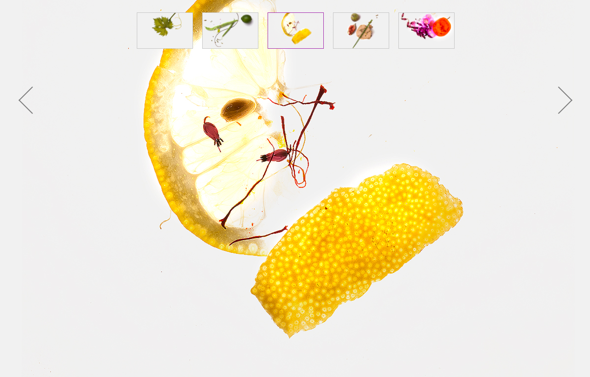

# Challenge Carousel !

Carousel, Carousel, dis-moi quelle image est la plus belle ?

## Objectif

Le but est de construire ce carousel d'image en JS :



## Plan

1. À partir des instructions ci-dessous, dresser (écrire) les principales fonctionnalités, en français - **via du texte**

2. Pour chaque étape du programme, construire le déroulé en français - **via du texte**

3. Commencer à coder en respectant le fil de pensée établi en `2.`

## Instructions

### Slider

1. Rajouter les 5 images à notre page, et **afficher uniquement la première image**.
 - ajouter les visuels à la page html
 - Trouver un moyen pour n'en afficher qu'une (toutes les masquer sauf la première)

2. Toutes les 5 secondes : faire **disparaître** l'image visible, et **apparaître** la suivante.
  - gestion du temps > timer > setInterval (toutes les X ms)
  - identifier l'image visible > usage de la class CSS active
  - display none sur l'image active
  - identifier l'image qui suit directement l'image visible
  - réussir à trouver le prochain élément dans le DOM
  - diplay block sur l'image suivante


3. Une fois arrivé à la dernière image, **on repart à zéro** (la dernière image disparaît, la première apparaît).

  - SI l'image suivante est vide
  - ALORS je repars de la première

4. Faire un effet de **fade in / fade out**, plutôt que apparaître / disparaître.

### BONUS - Flèches

1. **Générer** en JS des flèches stylisées uniquement grâce à des propriétés CSS.

2. Au clic sur une flèche, on affiche **l'image précédente** (pour la flèche gauche) ou **suivante** (pour la flèche droite).

3. Au clic sur une flèche, **on remet à zéro le compte à rebours** (Slider, point 2).

### EXTRA BONUS DE LA MORT - Thumbnails

1. **Générer** des vignettes de taille 120x77px. Chaque vignette reprend le `src` d'une image (voir resultat.png ci-dessus).

2. Au clic sur une vignette, on **affiche l'image correspondante**.

3. Au clic sur une vignette, **on remet à zéro le compte à rebours** (Slider, point 2).

4. La vignette active (celle qui correspond à l'image affichée) doit **avoir une bordure violette**.


## Charte

* Bordure thumbnail : `#ccc`
* Bordure thumbnail hover : `#999`
* Bordure thumbnail actif : `#a931b3`
* Flèches : `#999`
* Flèches hover : `#a931b3`


## Whaaaat ?!

### API

Vous pourriez avoir besoin de certaines de ces fonctions et propriétés :

* https://api.jquery.com/next/
* https://api.jquery.com/visible-selector/
* https://api.jquery.com/fadein/
* https://api.jquery.com/fadeout/
* https://api.jquery.com/stop/
* https://api.jquery.com/hasclass/
* https://api.jquery.com/addclass/
* https://developer.mozilla.org/fr/docs/Web/CSS/position
* https://developer.mozilla.org/fr/docs/Web/CSS/transition
* https://developer.mozilla.org/fr/docs/Web/CSS/transform
* https://developer.mozilla.org/fr/docs/Web/CSS/::before

(vous n'êtes pas obligé de tout utiliser !)

### Arbo

Voilà à quoi peut ressembler le DOM final :

```html
<div id="slider">
	<div id="slider-images">
		...
	</div>
	<div id="slider-thumbs">
		...
	</div>
	<div id="slider-left" class="slider-arrow"></div>
	<div id="slider-right" class="slider-arrow"></div>
</div>
```

(Suggestion uniquement !)
