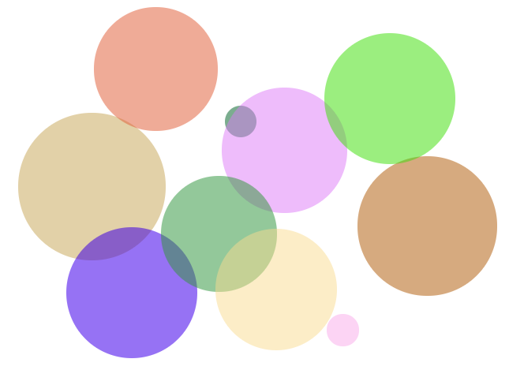

# Bulles JS

Créons des bulles :balloon:

## Instructions

### Sobre.

1. Ecouter le clic sur le document

2. Au clic, on crée une `
` que l'on rajoute au `<body>`   

3. Ce div doit s'afficher en un rond noir de 100px.

4. Le centre de la bulle doit s'afficher à l'endroit où l'on clique.
   Ces pages de docs peuvent vous aider :    
   https://api.jquery.com/event.pageX/   
   https://api.jquery.com/event.pageY/   
   https://api.jquery.com/category/events/event-object/   

### Pimpant !

1. Un peu de différence : à chaque clic, la bulle créée doit mesurer
entre 10 et 200px de diamètre, aléatoirement.  

2. Un peu de couleur : à chaque clic, la bulle créée doit avoir une
couleur aléatoire, avec une opacité aléatoire entre .5 et .75.  

(vous pouvez vous référer au jeu du plus petit plus grand pour retrouver comment on trouve un nombre aléatoire) 

#### BONUS : Let's dance

1. A la 20e bulle créée, toutes les bulles doivent tomber doucement
tout en bas de la fenêtre.

2. Une fois arrivée en bas, les bulles disparaissent en opacité.

3. On peut toujours continuer à créer des bulles, et à 20 bulles,
ça retombe à nouveau.

4. SUPER BONUS : faites en sorte que les bulles rebondissent quand elles tombent en bas de la fenêtre.
